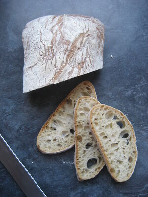

# 🥖 Ciabatta Deluxe

Þetta er **deluxe ciabatta uppskrift**, sem þarf að undirbúa deginum áður. Fullkomið fyrir þá sem vilja baka **í steinofni við háan hita**.

## **Innihaldsefni**
### **Dagur 1 (Forgerjun – Biga)**
- 250g hveiti  
- 180ml vatn  
- 1g þurrger  

### **Dagur 2 (Deig)**
- Allt biga fordeigið  
- 250g hveiti  
- 150ml vatn  
- 5g salt  
- 3g þurrger  
- 15ml ólífuolía  

---

## **Leiðbeiningar**
### **Dagur 1 – Undirbúningur biga (fordeig)**
1️⃣ **Blandaðu hveiti, vatni og geri saman** í skál.  
2️⃣ **Hyljið skálina** og leyfið henni að gerjast við stofuhita í **12-16 klst**.  

---

### **Dagur 2 – Aðal deig og bakstur**
1️⃣ **Blandaðu biga (fordeiginu) saman við nýtt hveiti, vatn, salt, ger og ólífuolíu**.  
2️⃣ **Hnoðaðu í 10 mínútur**, eða þar til deigið er slétt og teygjanlegt.  
3️⃣ **Látið hefast í 1,5 klst**, þar til deigið hefur tvöfaldast að stærð.  
4️⃣ **Skiptið deiginu í tvær ciabatta-lengjur** og leggið á bökunarstein eða ofnplötu.  
5️⃣ **Hitið steinofn í 250°C** (ef þú átt pizzaofn, notaðu hann!).  
6️⃣ **Bakið í 15-20 mínútur**, eða þar til brauðið er gullbrúnt og hefur fallega skorpu.  

---

🔥 **Njótið ristað með ólífuolíu, hvítlauk og ferskum mozzarella!**  

---
👉 [Til baka á forsíðu](../)