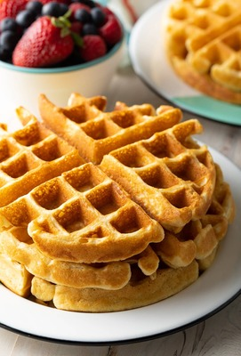

# Belgísku vöfflurnar hans Smára 🧇

## **Innihaldsefni**
- 2 bollar hveiti  
- 2 matskeiðar sykur  
- 1 matskeið lyftiduft  
- ½ teskeið salt  
- 2 egg  
- 1¾ bolli mjólk  
- ½ bolli brætt smjör  
- 1 teskeið vanilludropar  

## **Leiðbeiningar**
1. Hitaðu vöfflujárnið.  
2. Í stórri skál, hrærðu saman hveiti, sykur, lyftiduft og salt.  
3. Í annarri skál, pískaðu eggin og bættu við mjólk, bræddu smjöri og vanilludropum.  
4. Helltu blautu hráefnunum saman við þau þurra og hrærðu þar til deigið er samfellt.  
5. Smyrðu vöfflujárnið og helltu í það deiginu.  
6. Bakaðu í 3-5 mínútur eða þar til vöfflurnar eru gullinbrúnar.  
7. Berðu fram með uppáhalds meðlæti þínu (rjóma, ávöxtum, sýrópi o.fl.).  

**Njóttu!** 🍽️